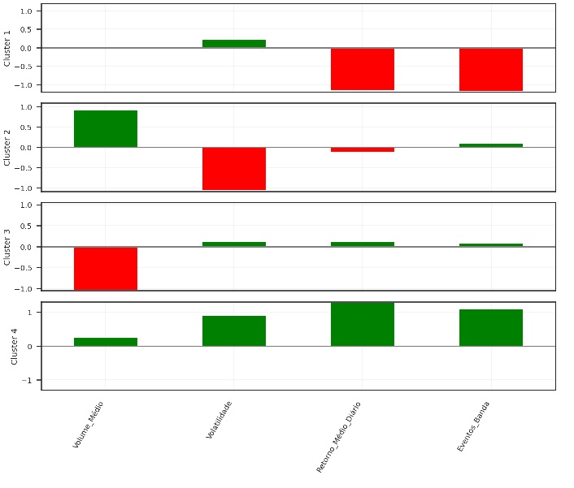

# Ibovespa Clustering Analysis

Este projeto utiliza técnicas de **Machine Learning** para realizar uma análise de clustering em ações do **Ibovespa** (Índice Bovespa), com o objetivo de identificar agrupamentos de ações com características financeiras semelhantes.

## 1. Objetivo

O objetivo deste projeto é utilizar **técnicas de aprendizado de máquina** (como o **K-Means** e **Hierarchical Clustering**) para segmentar ações do **Ibovespa** em clusters de acordo com suas características financeiras, como volume, volatilidade, retorno médio e indicadores de análise técnica como bandas de Bollinger.

## 2. Tecnologias Utilizadas

- **Python**: Linguagem de programação utilizada para análise de dados e machine learning.
- **Jupyter Notebook**: Ambiente interativo para desenvolvimento de código e visualização.
- **pandas**: Para manipulação e análise de dados.
- **numpy**: Para operações numéricas.
- **matplotlib / seaborn**: Para visualização de gráficos.
- **scikit-learn**: Para implementação dos algoritmos de clustering.
- **yfinance**: Para obtenção dos dados históricos de ações.

## 3. Como Rodar o Projeto

### 3.1. Clone este repositório

Primeiro, clone o repositório em sua máquina local:

```bash
git clone https://github.com/LeoFaleiros/Ibovespa-Clustering-Analysis.git
```

### 3.2. Instale as dependências
O projeto utiliza as bibliotecas listadas em requirements.txt. Para instalá-las, execute o seguinte comando:

```bash
pip install -r requirements.txt
```

### 3.3. Obtenha os dados
A composição do índice pode ser extraída diretamente do site da b3 [(clique aqui)](https://www.b3.com.br/pt_br/market-data-e-indices/indices/indices-amplos/indice-ibovespa-ibovespa-composicao-da-carteira.htm).

Os dados das ações do Ibovespa são obtidos através da API yfinance. Você pode obter os dados diretamente ao executar o notebook Ibovespa_Clustering.ipynb.

### 3.4. Execute o Notebook
Abra o notebook Ibovespa_Clustering.ipynb no Jupyter Notebook e execute as células de código para rodar a análise.

```bash
jupyter notebook
```

## 4. Interpretação dos Resultados
Após rodar a análise de clustering, você encontrará os gráficos e os clusters das ações, como mostrado no notebook.

```markdown
   
```

**Principais Insights**  
Cluster 1:  
- **Características**: Ações em tendência de baixa, com pouco interesse para negociação nas faixas de preço atuais. Essas ações podem não ser atrativas para investidores que buscam oportunidades de crescimento no curto prazo.

Cluster 2:  
- **Características**: Ações situadas em uma região de consolidação, com volume de negociação elevado e pouca volatilidade. Embora apresentem um retorno levemente negativo, não há grandes movimentos no preço, o que pode indicar que os investidores estão aguardando uma direção mais clara para decidir o próximo passo.

Cluster 3:  
- **Características**: Similar ao Cluster 2, mas com volume muito mais baixo, o que sugere um menor interesse em negociar essas ações na faixa de preço atual.

Cluster 4:  
- **Características**: Ações em forte tendência de alta, com um bom volume de negociação e alta volatilidade. Esses parâmetros indicam um potencial de valorização, com eventos de banda positiva que reforçam a tendência de alta. Essas ações podem ser altamente atraentes para investidores em busca de crescimento e dispostos a lidar com a volatilidade para maximizar os retornos.

**Gráfico Interativo**: Os gráficos interativos podem ser usados para explorar os clusters de maneira mais visual. Utilize a função interativa para visualizar os dados das ações e sua classificação.

## 5. Resultados Finais
Com a análise de clustering, foi possível identificar agrupamentos de ações que apresentam comportamentos semelhantes, o que pode ser útil para estratégias de diversificação de portfólio.

## 6. Contribuições
Sinta-se à vontade para contribuir com este projeto. Se você encontrar algum problema ou tiver uma sugestão de melhoria, abra uma issue ou envie um pull request.

